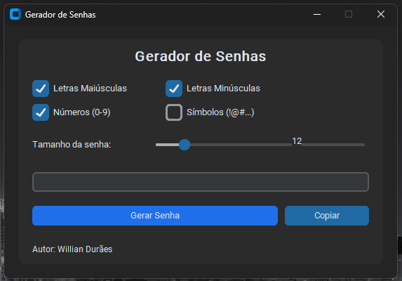

# 🔐 Gerador De Senhas

> Um gerador de senhas simples e elegante feito em Python com CustomTkinter. Ideal para gerar senhas fortes rapidamente via interface gráfica.

Projeto criado por Willian Durães.

## ✨ O Que Faz

- Gera senhas aleatórias com opções de:
  - Letras maiúsculas
  - Letras minúsculas
  - Números (0–9)
  - Símbolos (!@#...)
- Possui slider para ajustar o tamanho da senha (4 a 64 caracteres).
- Garante pelo menos 1 caractere de cada conjunto selecionado.
- Botão para copiar a senha diretamente para a área de transferência.

## 🧾 Requisitos

- Python 3.8 ou superior
- Biblioteca: `customtkinter`

Para instalar a dependência (Windows / PowerShell):

```powershell
python -m pip install --upgrade pip; pip install customtkinter
```

## ▶️ Como Executar

1. Abra o PowerShell na pasta do projeto (onde está o arquivo `App.py`).
2. Rode:

```powershell
python App.py
```

3. A interface será aberta. Selecione os tipos de caracteres desejados, ajuste o tamanho, clique em **Gerar Senha** e depois em **Copiar** para enviar a senha ao clipboard.

## 📸 Screenshots

- `screenshots/screenshot1.png` — Tela principal.
- `screenshots/screenshot2.png` — Senha gerada e cópia para área de transferência.





## 🔒 Observações Sobre Segurança

- O projeto usa o módulo `random` para gerar caracteres. Para necessidades de segurança mais rigorosas (por exemplo, senhas para contas críticas), recomendo usar o módulo `secrets` do Python, que é criptograficamente seguro.

Sugestões Rápidas:

- Substituir `random.choice` por `secrets.choice` e importar `secrets`.
- Adicionar opção para excluir caracteres ambíguos (ex.: `l`, `1`, `O`, `0`).

## 🛠 Melhorias Possíveis

- Salvar preferências do usuário (tamanho padrão, tipos selecionados).
- Exportar senhas para arquivo seguro (com criptografia).
- Adicionar testes automatizados e `requirements.txt`.

## 📦 Arquivos Importantes

- `App.py` — Código principal do gerador de senhas

## ✅ Autor

Feito por Willian Durães.

---
